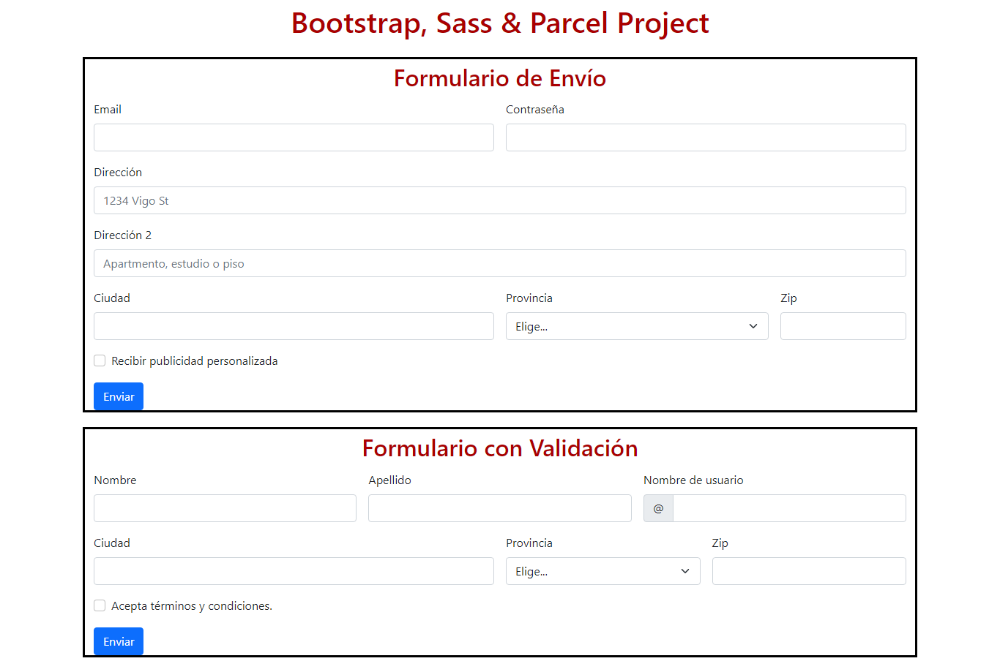
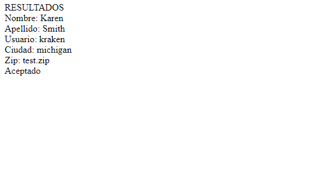
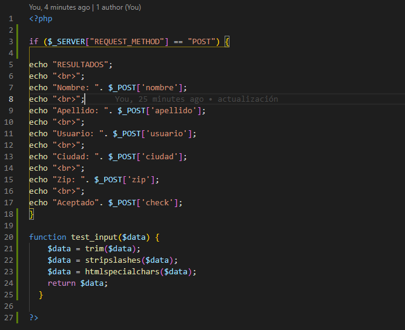

# Ejercicio de proyecto con bootstrap, sass y parcel para crear un sitio web

El objetivo del ejercicio es conseguir un sitio web con un formulario en PHP utilizando un entorno de desarrollo Sass/Parcel con incorporación de paquetes, empleando las herramientas de consola y la integración de un framework.

## Los pasos a seguir han sido los siguientes

1. Creación de la carpeta de proyecto y entrada en la misma por medio de la terminal de laragon, así como inicio de Visual Studio Code para programar.
2. Creación de un README.md donde se irán recogiendo los pasos y tareas hechas.
3. Inicialización de paquetes por consola con "npm init" y "npm install":
   - npm init -y
   - npm install bootstrap
   - npm install --save-dev parcel-bundler sass
4. Creación de la arquitectura de archivos:
   - carpetas src (index.html, index.js) y scss (style.scss), y archivo .sassrc
5. Añadido de código, principalmente para la estructura del index.html y las referencias a las hojas de estilo y los archivos de javascript.
6. Instalación de Popper con "npm install @popperjs/core"
7. Comprobación de creación de scripts con "start": "parcel ./src/index.html" dentro de package.json
8. Inicialización del proyecto con "npm start". Visualización en [link](http://localhost:1234), de momento en blaco ya que no hay contenido. Se ha creado automáticamente la carpeta dist, donde estarán los archivos de vista pública.
9. Edición de style.scss para la inclusión de estilos de bootstrap a la vista.
    - @import "../node_modules/bootstrap/scss/functions";
    - @import "../node_modules/bootstrap/scss/variables";
    - @import "../node_modules/bootstrap/scss/mixins";
    - @import "../node_modules/bootstrap/scss/root";
    - @import "../node_modules/bootstrap/scss/reboot";
    - @import "../node_modules/bootstrap/scss/type";
    - variables concretas con sus características y propiedades concretas
10. Añadido de un layout para el sitio web con recursos de [bootstrap](https://getbootstrap.com/docs/5.1/layout)
11. Añadido de un formulario con [bootstrap](https://getbootstrap.com/docs/5.1/forms) para mostrar por pantalla y otro con validación incluida y un action="texto.php" con el método "post" (esta última parte deja enviar el formulario pero no reproduce los datos por pantalla como era la intención; sin embargo, abriendo el proyecto desde laragon en vez de localhost sí se ejecuta el php pero los formularios se quedan sin el estilo de bootstrap).
12. Creación de un repositorio de Github para la documentación y envío del proyecto, excluyendo las carpetas de node_modules y .cache.

## Captura de la página realizada

## 24/01 ACTUALIZACIÓN

Líneas de package.json para añadir:

- "build": "parcel build src/index.html src/js/app.js src/css/custom.scss src/assets/* --public-url . -d build/",
- "dev": "parcel src/index.html src/js/validation.js scss/style.scss src/assets/*",

En terminal corremos: npm run-script build -> y se construye la carpeta

También añadimos las dependencias:

- npm install bootstrap-icons
- npm install nodemon
- npm install node-sass

Con estos últimos pasos conseguimos que el formulario se imprima en una nueva pantalla generada por texto.php, como se ve en la siguiente imagen:

Además, ahora sí se ha incluido en el archivo php una función de validación del método post, como se puede ver aquí:

